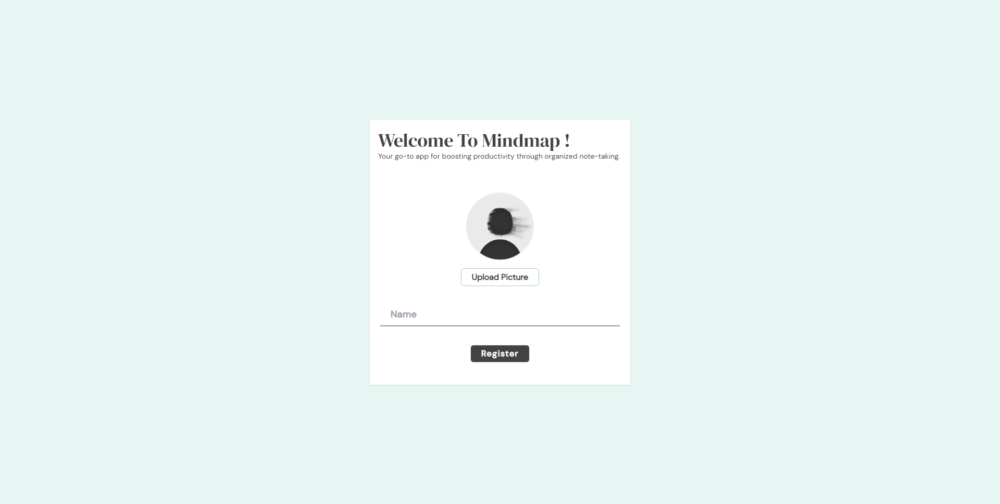
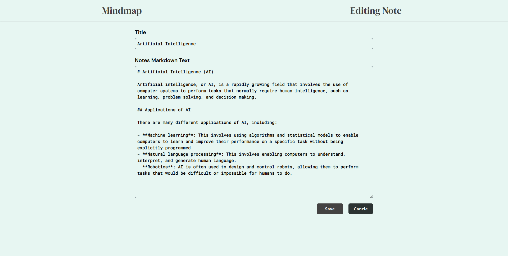

<div align="center">
  
</div>
<h1 align="center">
   Note Taking Web App
</h1>
<p align="center">
 Markdown supported <a href="https://mindmapnotes.netlify.app/" target="_blank">  notes taking web app </a> built with React, Typescript </a> and hosted with <a href="https://www.netlify.com/" target="_blank">Netlify</a>
</p>
<br />

### Click to <a href="https://mindmapnotes.netlify.app/" target="_blank"> Visit </a>

<br />
<br />
 <a href="https://mindmapnotes.netlify.app/" target="_blank">
    
    
  </a>
  
  <br />
<br />
  <br />
<br />

> The app is designed for effortless note taking with full CRUD functionality. It also supports the popular Markdown formatting language, making it easy to format and style your notes.

 <br />
<br />

## Built with

```bash

 Tyescript

 React

 TailwindCSS

```

  <br />

## Used

```bash
 Vite       React-Router-Dom
```

  <br />

### Color Reference

| Color      | Hex       |
| ---------- | --------- |
| Background | `#E7F6F2` |
| browm-ish  | `#434242` |

<br />

### Fonts

```bash
DM sans
DM serif
Alegreya
Roboto

```

<br />

## About

> **Markdown supported.** <br> **Search functionality for overloaded notes taking.** <br> **Provided CRUD functionalities with easy accessible.** <br> **Notes data handling with localstorage.** <br> **Include the ability to be responsive to all screen sizes.**

<br />
<br />
 
 
 <div align="center">
  
  <h6> Built By <a href="https://github.com/sumyat-aung/">Su Myat Aung</a></h1>
</div>
